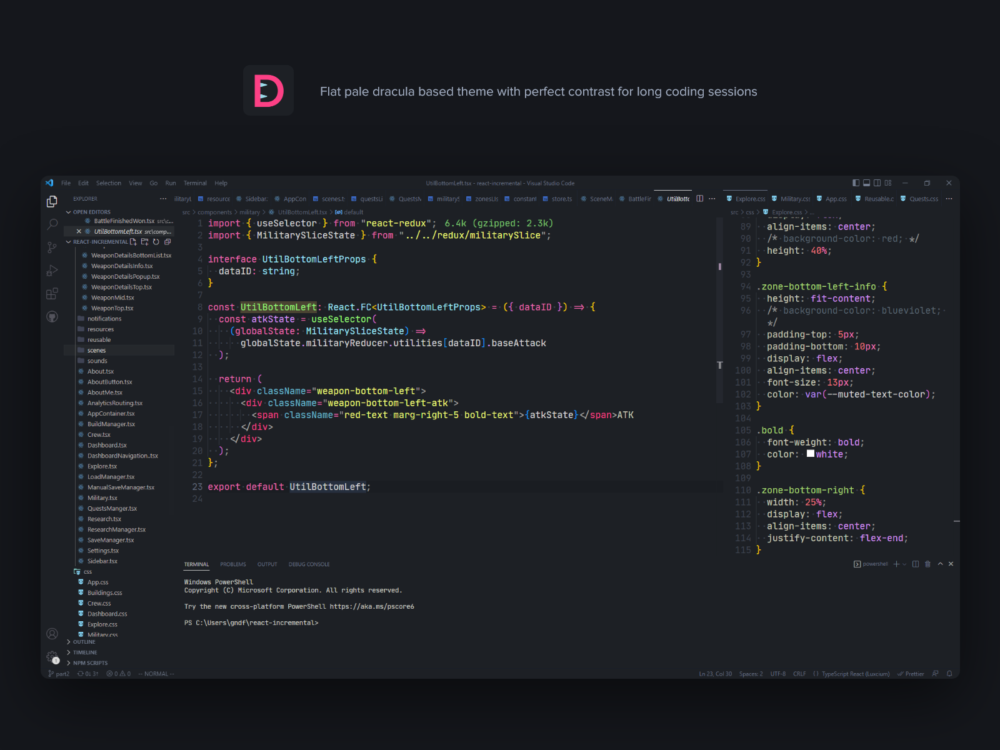

# Draculish Theme for VSCode

> Font: [Jet Brains Mono](https://www.jetbrains.com/lp/mono/)

## About

Flat and semi-pale dark theme mostly based on Dracula & Flate. Optimized for React with Typescript.

## Features

- Flat UI
- Perfect background color
- Accent colors mostly based on dracula palette
- Optimized for React with Typescript

## Installation

1. Open **Extensions** sidebar panel in Visual Studio Code.
2. Search for `Draculish`.
3. Click **Install** to install it.
